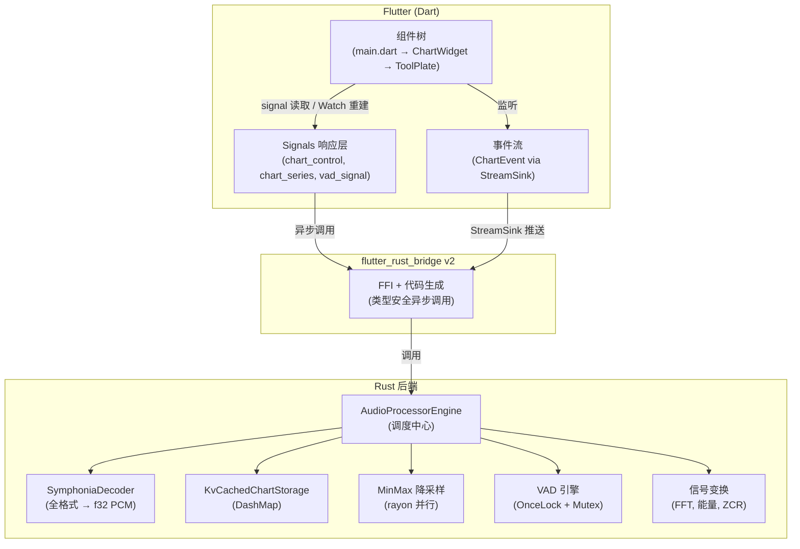
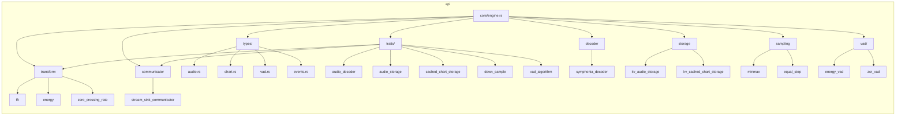
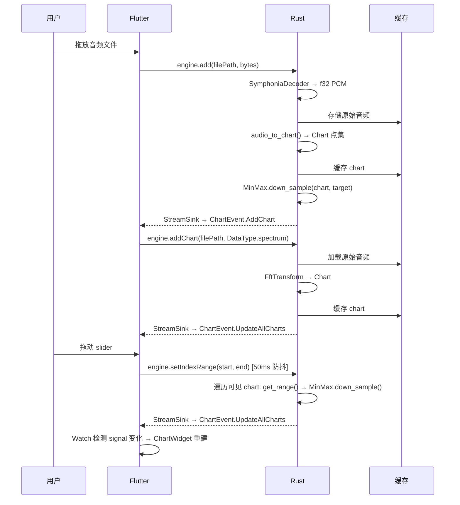
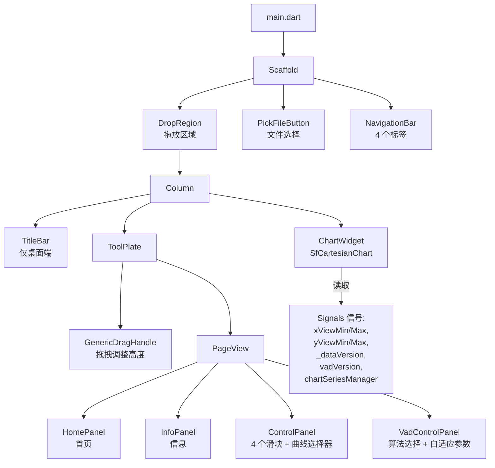
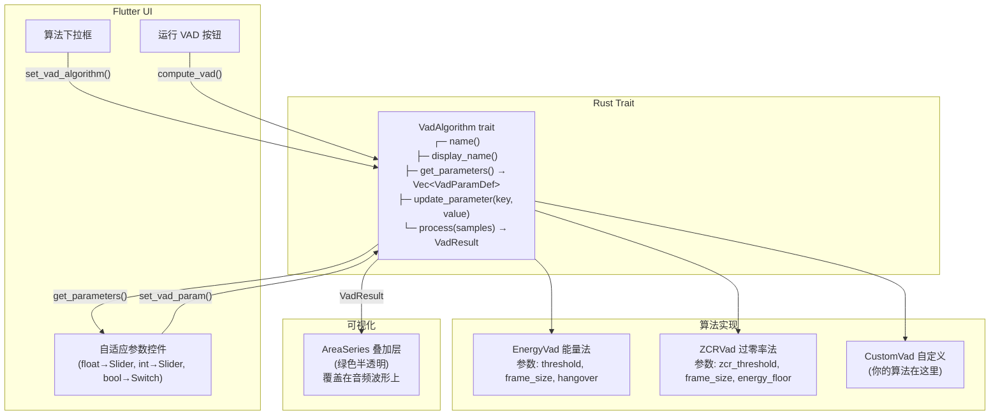
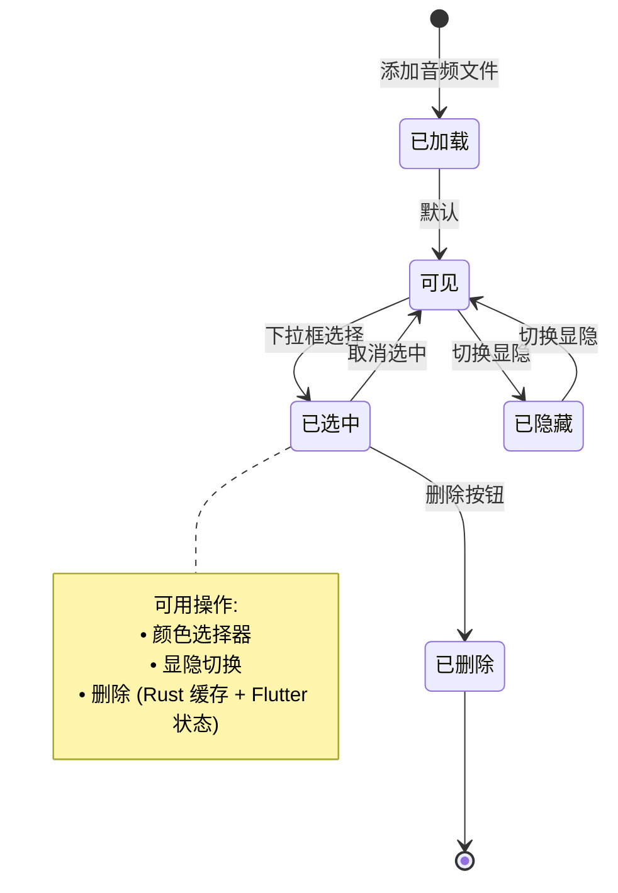

# VAD Flutter & Rust 音频分析工具

基于 **Flutter** 前端 + **Rust** 后端的高性能**语音活动检测 (VAD)** 与**音频分析**应用。

> [:us: English Version](README_EN.md)


## 🚀 概述

实时交互式音频分析与 VAD。Rust 处理 CPU 密集型信号处理（FFT、能量、ZCR），Flutter 提供响应式 Material 3 界面，支持 Syncfusion 图表、拖放加载文件和可插拔 VAD 算法。

### 核心特性

- **多算法 VAD**：内置能量法和过零率法，插件架构支持扩展新算法。
- **频谱分析**：FFT、能量、过零率计算，基于 `rustfft` + `rayon` 并行加速。
- **线粒度自管理**：颜色、显隐、选中、删除全部由 `ChartSeriesManager` 统一管理，不依赖图表库内部状态。
- **自适应 VAD 参数 UI**：每个算法通过 trait 暴露可调参数，UI 自动渲染 Slider、Switch、Dropdown。
- **通用编解码**：Symphonia 支持 MP3、WAV、FLAC、AAC 等格式。
- **智能缓存**：DashMap 键值存储 + MinMax 降采样，视图变化时仅处理可见曲线。

---

## 🏗️ 架构

### 系统总览



### Rust 模块层次



### 数据管线



### Flutter 组件树



### VAD 插件架构



### 曲线自管理状态机



---

## 🛠️ 快速开始

### 环境要求

- **Flutter SDK**: `^3.9.4`
- **Rust 工具链**: Stable
- **FVM**（可选）：管理 Flutter 版本

### 安装运行

```bash
git clone https://github.com/fans963/vad_flutter_and_rust.git
cd vad_flutter_and_rust

# 安装依赖
flutter pub get

# 生成 Rust-Flutter 桥接代码（修改 Rust 后必须执行）
flutter_rust_bridge_codegen generate

# 运行
flutter run
```

---

## 📂 项目结构

```
vad_flutter_and_rust/
├── lib/                          # Flutter 源码
│   ├── main.dart                 # 入口、窗口管理、拖放
│   └── src/
│       ├── signals/              # 响应式状态 (signals 包)
│       │   ├── audio_processor_signal.dart
│       │   ├── chart_control_signal.dart
│       │   ├── chart_series_signal.dart   # 曲线元数据管理器
│       │   ├── page_controller_signal.dart
│       │   ├── support_audio_format_signal.dart
│       │   └── vad_signal.dart
│       ├── ui/                   # 组件
│       │   ├── chart_widget.dart
│       │   ├── pick_file_button.dart
│       │   ├── title_bar.dart
│       │   ├── tool_plate.dart   # 底部面板: 滑块 + 曲线选择
│       │   └── vad_control_panel.dart
│       ├── util/
│       │   ├── drag_handler.dart
│       │   └── util.dart
│       └── rust/api/             # 自动生成的 FRB 绑定
├── rust/                         # Rust 源码
│   ├── Cargo.toml
│   └── src/
│       ├── lib.rs
│       ├── frb_generated.rs      # 自动生成 FFI 胶水代码
│       └── api/
│           ├── core/engine.rs    # AudioProcessorEngine
│           ├── traits/           # 7 个 trait (decoder, storage, transform, ...)
│           ├── types/            # 数据结构
│           ├── decoder/          # Symphonia 解码器
│           ├── storage/          # KV 音频/图表存储
│           ├── sampling/         # MinMax + EqualStep 降采样
│           ├── transform/        # FFT, 能量, ZCR
│           ├── communicator/     # StreamSink 事件推送
│           ├── events/           # 全局 StreamSink 单例
│           └── vad/              # 可插拔 VAD 算法
├── assets/                       # 图片、字体
└── pubspec.yaml
```

---

## 🤝 贡献

欢迎贡献代码：

1. Fork 本项目
2. 创建特性分支 (`git checkout -b feature/AmazingFeature`)
3. 提交更改 (`git commit -m 'Add some AmazingFeature'`)
4. 推送到分支 (`git push origin feature/AmazingFeature`)
5. 发起 Pull Request

### 添加新的 VAD 算法

1. 创建 `rust/src/api/vad/my_vad.rs`，实现 `VadAlgorithm` trait
2. 在 `rust/src/api/vad/mod.rs` 的 `create_vad()` 和 `list_algorithm_names()` 中注册
3. 运行 `flutter_rust_bridge_codegen generate`
4. UI 自动根据 `get_parameters()` 渲染参数控件 — **无需修改 Flutter 代码**

---

## 👥 开发者

- **fans963**
- **🐂津哥**

## 📄 许可证

MIT。详见 `LICENSE` 文件。
