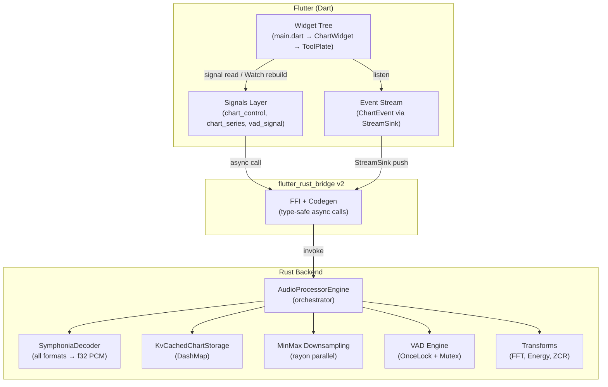
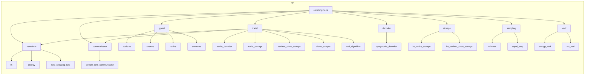
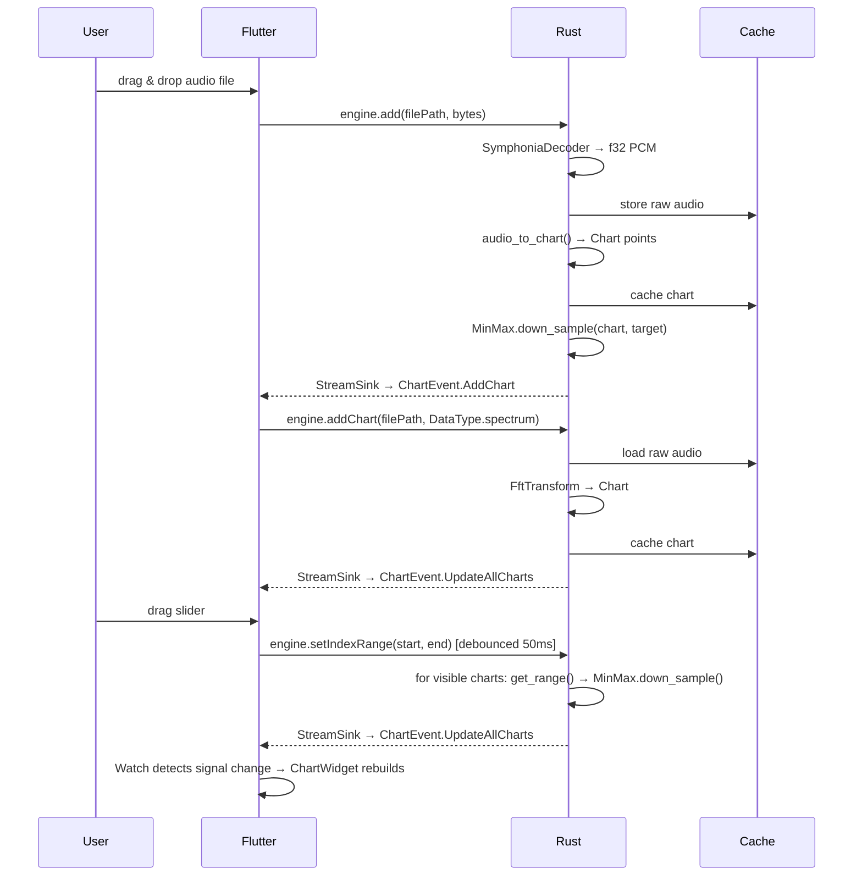
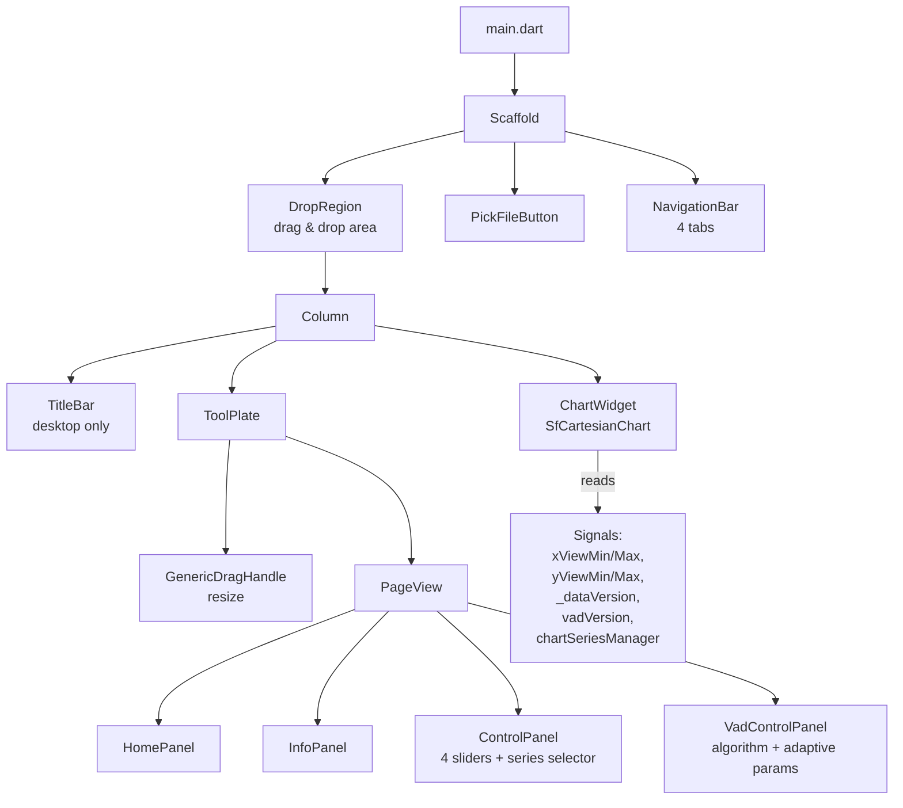
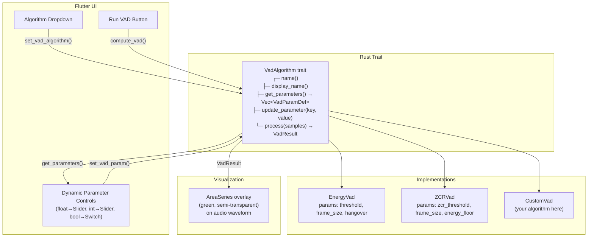
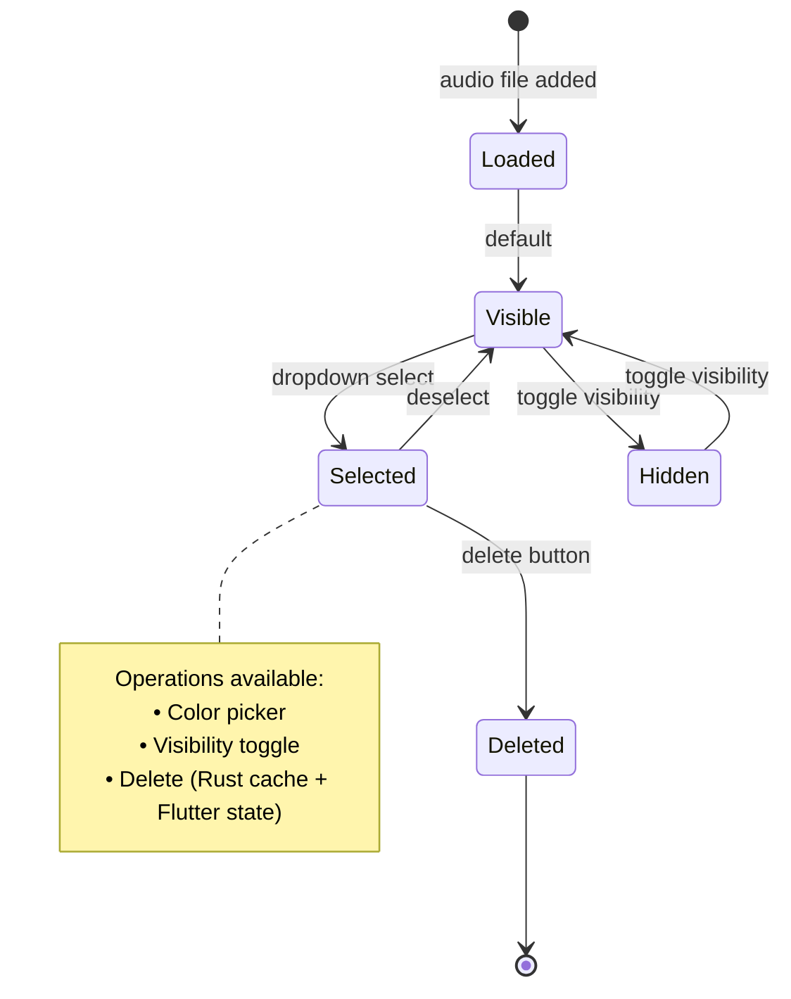

# VAD Flutter & Rust Audio Analysis Tool

A professional-grade **Voice Activity Detection (VAD)** and **Audio Analysis** application built with **Flutter** for the frontend and **Rust** for high-performance signal processing.

> [:cn: 中文版本](README.md)


## 🚀 Overview

Real-time interactive audio analysis with VAD. Rust handles CPU-intensive signal processing (FFT, energy, ZCR) while Flutter provides a reactive Material 3 UI with Syncfusion charting, drag-and-drop file loading, and pluggable VAD algorithms.

### Key Features

- **Multi-Algorithm VAD**: Energy-based and Zero-Crossing Rate detection, with a plugin architecture for adding new algorithms.
- **Spectral Analysis**: FFT, Energy, and Zero-Crossing Rate computation via `rustfft` + `rayon` parallelism.
- **Self-Managed Chart Series**: Full control over series visibility, color, selection, and deletion — no dependency on chart library internals.
- **Adaptive VAD Parameter UI**: Each algorithm exposes its tunable parameters; the UI renders Sliders, Switches, and Dropdowns automatically.
- **Universal Codec Support**: MP3, WAV, FLAC, AAC, etc. via the Symphonia library.
- **Smart Caching**: DashMap key-value storage + MinMax downsampling; only visible charts are processed on view changes.

---

## 🏗️ Architecture

### System Overview



### Rust Module Hierarchy



### Data Pipeline



### Flutter Widget Tree



### VAD Plugin Architecture



### Chart Series State Machine



---

## 🛠️ Getting Started

### Prerequisites

- **Flutter SDK**: `^3.9.4`
- **Rust Toolchain**: Stable
- **FVM** (optional): Flutter version management

### Installation

```bash
git clone https://github.com/fans963/vad_flutter_and_rust.git
cd vad_flutter_and_rust

# Install dependencies
flutter pub get

# Generate Rust-Flutter bridge code (required after Rust changes)
flutter_rust_bridge_codegen generate

# Run
flutter run
```

---

## 📂 Project Structure

```
vad_flutter_and_rust/
├── lib/                          # Flutter source
│   ├── main.dart                 # Entry, window/tray, drag-drop
│   └── src/
│       ├── signals/              # Reactive state (signals package)
│       │   ├── audio_processor_signal.dart
│       │   ├── chart_control_signal.dart
│       │   ├── chart_series_signal.dart   # Per-series metadata manager
│       │   ├── page_controller_signal.dart
│       │   ├── support_audio_format_signal.dart
│       │   └── vad_signal.dart
│       ├── ui/                   # Widgets
│       │   ├── chart_widget.dart
│       │   ├── pick_file_button.dart
│       │   ├── title_bar.dart
│       │   ├── tool_plate.dart   # Bottom panel: sliders + series selector
│       │   └── vad_control_panel.dart
│       ├── util/
│       │   ├── drag_handler.dart
│       │   └── util.dart
│       └── rust/api/             # Generated FRB bindings
├── rust/                         # Rust source
│   ├── Cargo.toml
│   └── src/
│       ├── lib.rs
│       ├── frb_generated.rs      # Auto-generated FFI glue
│       └── api/
│           ├── core/engine.rs    # AudioProcessorEngine
│           ├── traits/           # 7 traits (decoder, storage, transform, ...)
│           ├── types/            # Data structures
│           ├── decoder/          # Symphonia decoder
│           ├── storage/          # KV audio/chart storage
│           ├── sampling/         # MinMax + EqualStep downsampling
│           ├── transform/        # FFT, Energy, ZCR
│           ├── communicator/     # StreamSink event emission
│           ├── events/           # Global StreamSink singleton
│           └── vad/              # Pluggable VAD algorithms
├── assets/                       # Images, fonts
└── pubspec.yaml
```

---

## 🤝 Contributing

Contributions are welcome:

1. Fork the Project
2. Create your Feature Branch (`git checkout -b feature/AmazingFeature`)
3. Commit your Changes (`git commit -m 'Add some AmazingFeature'`)
4. Push to the Branch (`git push origin feature/AmazingFeature`)
5. Open a Pull Request

### Adding a New VAD Algorithm

1. Create `rust/src/api/vad/my_vad.rs` implementing `VadAlgorithm` trait
2. Register in `rust/src/api/vad/mod.rs` → `create_vad()` and `list_algorithm_names()`
3. Run `flutter_rust_bridge_codegen generate`
4. The UI automatically renders parameters from `get_parameters()` — no Flutter changes needed

---

## 👥 Developers

- **fans963**
- **🐂津哥**

## 📄 License

MIT. See `LICENSE` for details.
